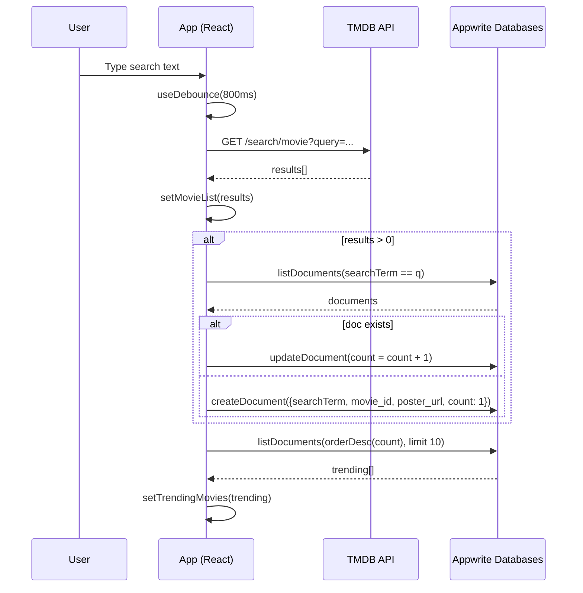

## Flixify

Discover and explore movies with a modern React + Vite app. Flixify fetches data from TMDB and tracks trending searches in Appwrite to showcase the top-searched posters.

### Tech stack

- React 19, Vite 7
- Tailwind CSS (via `@tailwindcss/vite`)
- Appwrite (Databases)

---

### Architecture sequence (search and trending)



### App flow

```mermaid
flowchart TD
    Start[App start] --> Init[useEffect: loadTrendingMovies]
    Init --> GetTrending[getTrendingMovies -> Appwrite]
    GetTrending --> TrendingState[setTrendingMovies]
    Start --> SearchInput[User types in Search]
    SearchInput --> Debounce[useDebounce 800ms]
    Debounce --> Fetch[fetchMovies()]
    Fetch --> TMDB[(TMDB API)]
    TMDB --> Parse{response ok?}
    Parse -- no --> Err[setErrorMessage]
    Parse -- yes --> List[setMovieList]
    List --> MaybeUpdate{query && results > 0?}
    MaybeUpdate -- yes --> Update[updateSearchCount -> Appwrite]
    MaybeUpdate -- no --> Continue
    List --> UI[Render grid + pagination]
    UI --> Click[Click movie]
    Click --> Modal[Open MovieDetails]
    Modal --> DetailsFetch[fetch details from VITE_API_BASE_URL]
    DetailsFetch --> Display[Render details/trailer]
    Display --> Close[Close modal]
```

---

### Prerequisites

- Node.js 18+
- TMDB v4 Read Access Token
- Appwrite project and database (Cloud or self-hosted, HTTPS endpoint)

### Environment variables

Create a `.env.local` file in `flixify/`:

```bash
VITE_TMDB_API_KEY=YOUR_TMDB_V4_READ_TOKEN
VITE_API_BASE_URL=https://api.themoviedb.org/3

VITE_APPWRITE_ENDPOINT=https://nyc.cloud.appwrite.io/v1
VITE_APPWRITE_PROJECT_ID=YOUR_PROJECT_ID
VITE_APPWRITE_DATABASE_ID=YOUR_DATABASE_ID
VITE_APPWRITE_COLLECTION_ID=YOUR_COLLECTION_ID
```

Notes:

- Values must be raw (no quotes). Redeploy/restart after changes—Vite inlines at build-time.
- If you use a different Appwrite region/host, update `VITE_APPWRITE_ENDPOINT` accordingly. Must be HTTPS.

### Appwrite setup (quick)

1. In Appwrite Console → Project → Platforms → Add Platform → Web. Add your local `http://localhost:5173` and deployed domain (e.g., `https://<project>.vercel.app`).
2. Databases → Create Database → Create Collection.
3. Add attributes on the collection (names must match code):
   - `searchTerm` (string, required, filterable)
   - `movie_id` (string or integer, optional)
   - `count` (integer, required, default 1, sortable)
   - `poster_url` (string, optional)
4. (Recommended) Indexes:
   - Equality index on `searchTerm`
   - Sort index on `count` (descending)
5. Permissions: ensure the collection allows reads from your app users (e.g., role:all read) or configure appropriate auth.

---

### Local development

```bash
cd flixify
npm install
npm run dev
```

Open the printed `http://localhost:5173` URL.

Useful scripts:

- `npm run build` → production build to `dist/`
- `npm run preview` → preview the production build locally
- `npm run lint` → run ESLint

### Deployment (Vercel)

- Project Settings → General → Root Directory: set to `flixify`
- Environment Variables (Production/Preview): set the same keys as in `.env.local` (no quotes)
- Build Command: `npm run build`
- Output Directory: `dist`
- Install Command: `npm install`
- After deploy, ensure your Vercel domain is added as an Appwrite Web Platform (see Appwrite setup above)

---

### Key files

- `src/App.jsx` → search, debounced fetch to TMDB, pagination, trending section
- `src/components/MovieDetails.jsx` → modal with details/trailer (uses `VITE_API_BASE_URL` + TMDB)
- `src/appwrite.js` → Appwrite client + `updateSearchCount` and `getTrendingMovies`
- `vite.config.js` → React + Tailwind plugin

---

### Summary

- Flixify fetches movies from TMDB and maintains a trending list using Appwrite counts.
- Configure env vars, Appwrite Web Platform, and collection attributes exactly as shown.
- Local dev: `npm run dev`. Deploy on Vercel with Root Directory `flixify` and env vars set.
